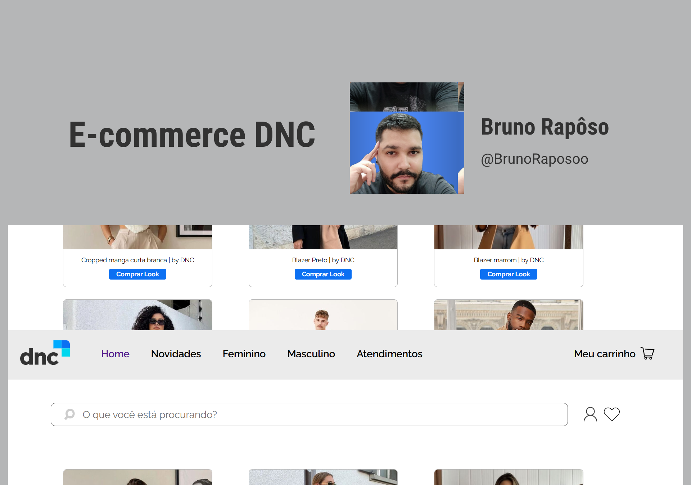

<h1 align="center"> E-commerce DNC </h1>

  <a href="#-tecnologias">Tecnologias</a>&nbsp;&nbsp;&nbsp;|&nbsp;&nbsp;&nbsp;
  <a href="#-projeto">Projeto</a>&nbsp;&nbsp;&nbsp;|&nbsp;&nbsp;&nbsp;
  <a href="#-layout">Layout</a>&nbsp;&nbsp;&nbsp

 

  

## 🚀 Tecnologias

Esse projeto foi desenvolvido com as seguintes tecnologias:

- [ReactJS](https://react.dev/)
- [React Router](https://reactrouter.com/en/main)
- [SASS](https://sass-lang.com/)

## 💻 Projeto

Projeto desenvolvido para criar um págia de e-commerce.    
Para acessar o projeto clique [AQUI]()

## 🔖 Layout

Você pode visualizar o layout do projeto através [DESSE LINK](https://www.figma.com/file/fPnBMnpYtFvonWZxMi3bos/Projeto-E-commerce?type=design&node-id=0-1&mode=design&t=AHrWiqCfIMPbhKJ7-0). É necessário ter conta no [Figma](https://figma.com) para acessá-lo.